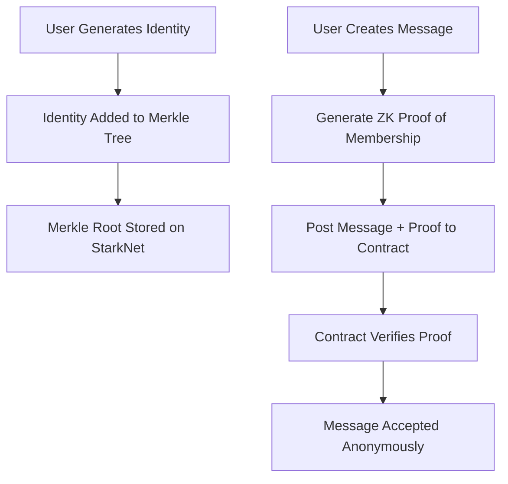

# zkAnon Chat 🔒🕵️‍♂️

A **zero-knowledge anonymous chat protocol** built on StarkNet that allows group members to post messages without revealing their identity. Users prove membership using zk-SNARKs while maintaining complete privacy.

## 🎯 Problem Solved

Traditional anonymous chat systems either:
- Reveal metadata about participants
- Require trusted intermediaries
- Lack cryptographic proof of membership

zkAnon Chat solves this by using **zero-knowledge proofs** to verify group membership without revealing which specific member is posting.

## 🛠️ How It Works

### Architecture

### Technical Components
Noir ZK Circuit (/circuit)

Merkle tree membership verification

Proof generation without revealing identity

Efficient proof computation

Cairo Smart Contract (/contract)

Merkle root storage and management

ZK proof verification

Anonymous message storage

Group administration functions

Key Cryptographic Primitives

Pedersen hashing for commitments

Merkle trees for group membership

STARK-proof verification
```

```
### 🚀 Features
True Anonymity: Messages cannot be traced to specific members

Proof of Membership: Only authorized group members can post

Decentralized: No central authority required

Transparent Verification: All proofs are publicly verifiable

Gas Efficient: Optimized for StarkNet's ZK-friendly environment
```

```
### 🛠️ Installation & Setup
Prerequisites
Rust: curl --proto '=https' --tlsv1.2 -sSf https://sh.rustup.rs | sh

Scarb: curl --proto '=https' --tlsv1.2 -sSf https://docs.swmansion.com/scarb/install.sh | sh

Noir: curl -L https://raw.githubusercontent.com/noir-lang/noirup/main/install | bash && noirup

StarkNet Foundry: curl -L https://raw.githubusercontent.com/foundry-rs/starknet-foundry/master/scripts/install.sh | bash
```

```
# Build Instruction
### Clone the repository
git clone https://github.com/your-username/zkAnon.git

cd zkAnon

### Build the ZK circuit

cd circuit

nargo check

### Build and test the smart contract
cd ../contract

scarb build

snforge test
```

```
# 📖 Usage
### 1. Group Setup

Contract deploys with empty merkle root

Group admin adds members by updating merkle root

## 2. Member Interaction

User generates membership proof offline

nargo prove

User submits message with proof

Contract verifies proof and stores message

## 3. Message Retrieval

Anyone can read anonymous messages

Messages are completely unlinkable to authors
```

```
# 🧪 Testing

### Run circuit tests
cd circuit

nargo test

### Run contract tests  
cd ../contract

snforge test
```

```
### 🔮 Future Enhancements
Multi-message support with nullifiers

Message encryption for private groups

Web frontend for user-friendly interaction

Gas optimization for batch verification

Cross-group messaging capabilities
```

```
### 📝 License
MIT License - see LICENSE file for details
```
